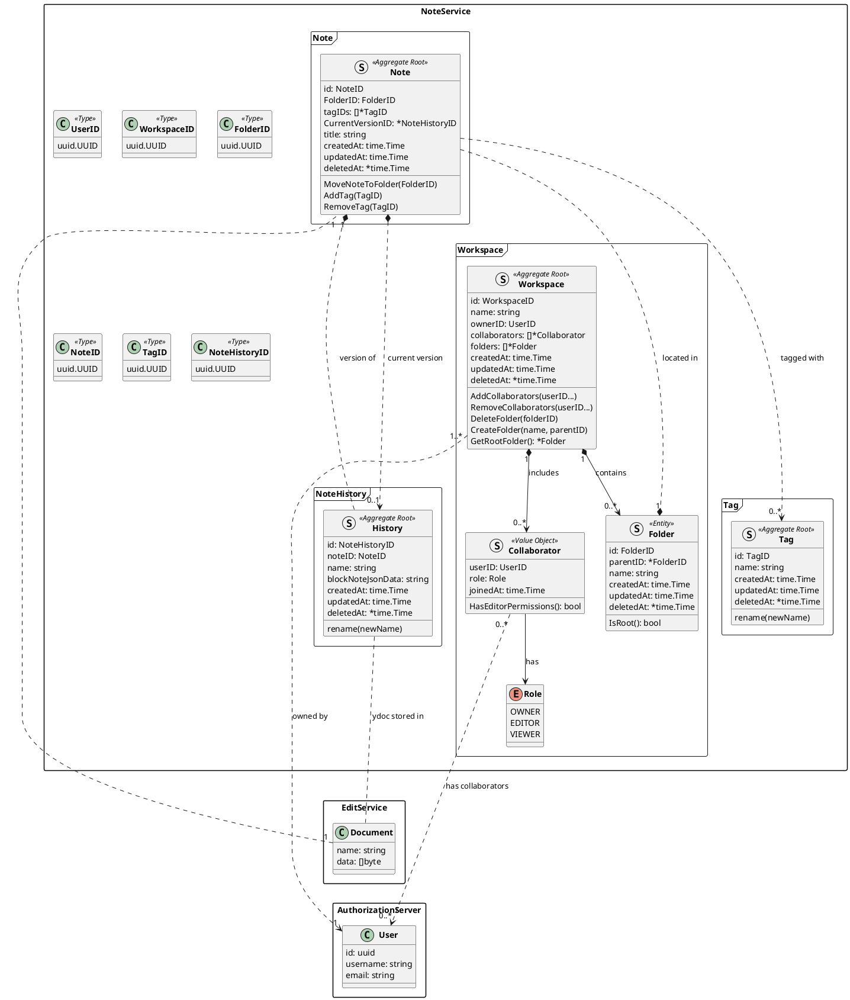

<!-- vim:set tabstop=4 shiftwidth=4: -->

# Class diagram

```plantuml
@startuml Notopia

skinparam classFontStyle bold
skinparam classAttributeIconSize 0
skinparam packageStyle rectangle
/' skinparam linetype ortho '/
/' skinparam linetype polyline '/

package "AuthorizationServer" {
    class "User" as AuthorizationServer.User {
        id: uuid
        username: string
        email: string
    }
}

package "EditService" {
    class "Document" as EditService.Document {
        name: string
        data: []byte
    }
}

package "NoteService" {
    class "UserID" as NoteService.UserID <<Type>> {
        uuid.UUID
    }

    class "WorkspaceID" as NoteService.WorkspaceID <<Type>> {
        uuid.UUID
    }

    class "FolderID" as NoteService.FolderID <<Type>> {
        uuid.UUID
    }

    class "NoteID" as NoteService.NoteID <<Type>> {
        uuid.UUID
    }

    class "TagID" as NoteService.TagID <<Type>> {
        uuid.UUID
    }

    class "NoteHistoryID" as NoteService.NoteHistoryID <<Type>> {
        uuid.UUID
    }

    package "NoteService.Workspace" <<Frame>> {
        enum "Role" as NoteService.Workspace.Role {
            OWNER
            EDITOR
            VIEWER
        }

        struct "Workspace" as NoteService.Workspace.Workspace <<Aggregate Root>> {
            id: WorkspaceID
            name: string
            ownerID: UserID
            collaborators: []*Collaborator
            folders: []*Folder
            createdAt: time.Time
            updatedAt: time.Time
            deletedAt: *time.Time

            AddCollaborators(userID...)
            RemoveCollaborators(userID...)
            DeleteFolder(folderID)
            CreateFolder(name, parentID)
            GetRootFolder(): *Folder
        }

        struct "Folder" as NoteService.Workspace.Folder <<Entity>> {
            id: FolderID
            parentID: *FolderID
            name: string
            createdAt: time.Time
            updatedAt: time.Time
            deletedAt: *time.Time

            IsRoot(): bool
        }

        struct "Collaborator" as NoteService.Workspace.Collaborator <<Value Object>> {
              userID: UserID
              role: Role
              joinedAt: time.Time

              HasEditorPermissions(): bool
        }

        NoteService.Workspace.Workspace "1" *--> "0..*" NoteService.Workspace.Folder : contains
        NoteService.Workspace.Workspace "1" *--> "0..*" NoteService.Workspace.Collaborator : includes
        NoteService.Workspace.Collaborator --> NoteService.Workspace.Role : has
    }

    package "NoteService.Note" <<Frame>> {
        struct "Note" as NoteService.Note.Note <<Aggregate Root>> {
            id: NoteID
            FolderID: FolderID
            tagIDs: []*TagID
            CurrentVersionID: *NoteHistoryID
            title: string
            createdAt: time.Time
            updatedAt: time.Time
            deletedAt: *time.Time

            MoveNoteToFolder(FolderID)
            AddTag(TagID)
            RemoveTag(TagID)
        }
    }

    package "NoteService.NoteHistory" <<Frame>> {
        struct "History" as NoteService.NoteHistory.History <<Aggregate Root>> {
            id: NoteHistoryID
            noteID: NoteID
            name: string
            blockNoteJsonData: string
            createdAt: time.Time
            updatedAt: time.Time
            deletedAt: *time.Time

            rename(newName)
        }
    }

    package "NoteService.Tag" <<Frame>> {
        struct "Tag" as NoteService.Tag.Tag <<Aggregate Root>> {
            id: TagID
            name: string
            createdAt: time.Time
            updatedAt: time.Time
            deletedAt: *time.Time

            rename(newName)
        }
    }

    NoteService.Note.Note *...> "0..1" NoteService.NoteHistory.History : current version
    NoteService.Note.Note ...> "0..*" NoteService.Tag.Tag : tagged with
    NoteService.Note.Note ...* "1" NoteService.Workspace.Folder: located in

    NoteService.NoteHistory.History ... EditService.Document: ydoc stored in
    NoteService.NoteHistory.History ...* "1" NoteService.Note.Note: version of
}

NoteService.Workspace.Workspace "1..*" ....> "1" AuthorizationServer.User: owned by
NoteService.Workspace.Collaborator "0..*" ....> "0..*" AuthorizationServer.User: has collaborators

EditService.Document "1" .... "1" NoteService.Note.Note

@enduml
```

<!-- diagram id="class-diagram" -->
