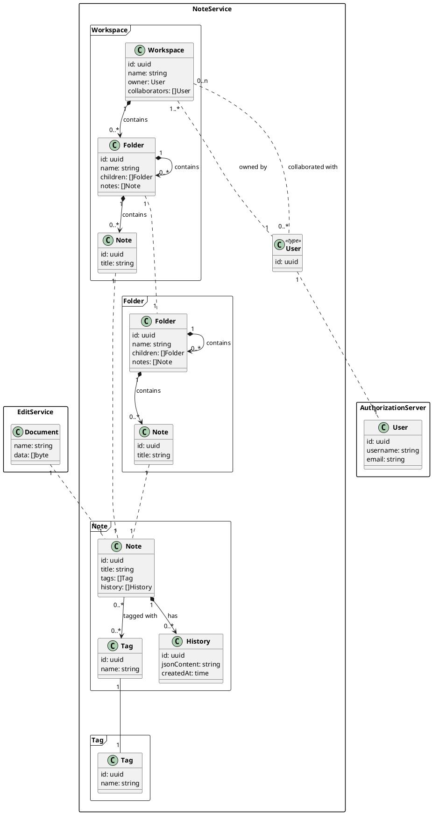

# Class diagram

```plantuml
@startuml Notopia

skinparam classFontStyle bold
skinparam classAttributeIconSize 0
skinparam packageStyle rectangle
/' skinparam linetype ortho '/
/' skinparam linetype polyline '/

package "AuthorizationServer" {
  class "User" as AuthorizationServer.User {
    id: uuid
    username: string
    email: string
  }
}

package "EditService" {
  class "Document" as EditService.Document {
    name: string
    data: []byte
  }
}

package "NoteService" {
  class "User" as NoteService.User <<type>> {
    id: uuid
  }

  package "NoteService.Workspace" <<Frame>> {
    class "Workspace" as NoteService.Workspace.Workspace {
      id: uuid
      name: string
      owner: User
      collaborators: []User
    }

    class "Folder" as NoteService.Workspace.Folder {
      id: uuid
      name: string
      children: []Folder
      notes: []Note
    }

    class "Note" as NoteService.Workspace.Note {
      id: uuid
      title: string
    }

    NoteService.Workspace.Workspace "1" *--> "0..*" NoteService.Workspace.Folder : contains
    NoteService.Workspace.Folder "1" *--> "0..*" NoteService.Workspace.Note : contains
    NoteService.Workspace.Folder "1" *--> "0..*" NoteService.Workspace.Folder : contains

    NoteService.Workspace.Workspace "1..*" ... "1" NoteService.User: owned by
    NoteService.Workspace.Workspace "0..n" ... "0..*" NoteService.User: collaborated with
  }

  package "NoteService.Folder" <<Frame>> {
    class "Folder" as NoteService.Folder.Folder {
      id: uuid
      name: string
      children: []Folder
      notes: []Note
    }

    class "Note" as NoteService.Folder.Note {
      id: uuid
      title: string
    }

    NoteService.Folder.Folder "1" *--> "0..*" NoteService.Folder.Folder : contains
    NoteService.Folder.Folder "1" *--> "0..*" NoteService.Folder.Note : contains
  }

  package "NoteService.Note" <<Frame>> {
    class "Note" as NoteService.Note.Note {
      id: uuid
      title: string
      tags: []Tag
      history: []History
    }

    class "Tag" as NoteService.Note.Tag {
      id: uuid
      name: string
    }

    class "History" as NoteService.Note.History {
      id: uuid
      jsonContent: string
      createdAt: time
    }

    NoteService.Note.Note "1" *--> "0..*" NoteService.Note.History : has
    NoteService.Note.Note "0..*" --> "0..*" NoteService.Note.Tag : tagged with
  }

  package "NoteService.Tag" <<Frame>> {
    class "Tag" as NoteService.Tag.Tag {
      id: uuid
      name: string
    }
  }

  NoteService.Workspace.Folder "1" ... "1" NoteService.Folder.Folder
  NoteService.Workspace.Note "1" ... "1" NoteService.Note.Note
  NoteService.Folder.Note "1" ... "1" NoteService.Note.Note
  NoteService.Note.Tag "1" --- "1" NoteService.Tag.Tag
}

NoteService.User "1" ... "1" AuthorizationServer.User
EditService.Document "1" ... "1" NoteService.Note.Note

@enduml
```

<!-- diagram id="class-diagram" -->
