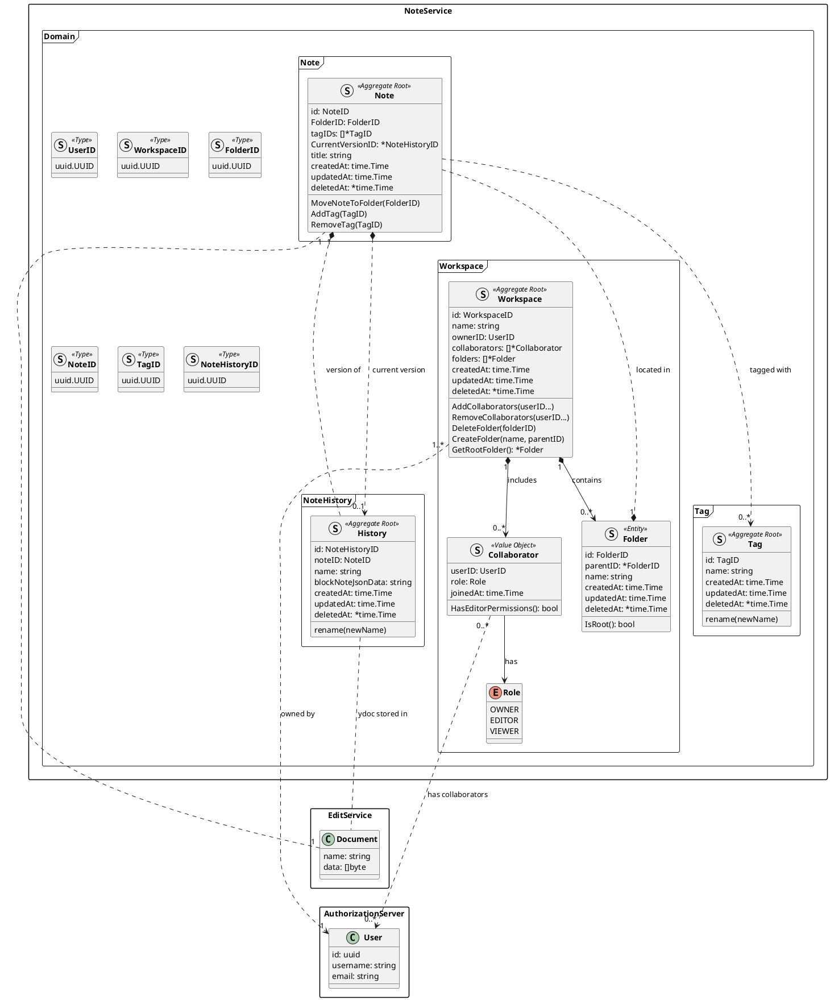

# Class diagram

```plantuml
@startuml Notopia

skinparam classFontStyle bold
skinparam classAttributeIconSize 0
skinparam packageStyle rectangle
/' skinparam linetype ortho '/
/' skinparam linetype polyline '/

package "AuthorizationServer" {
    class "User" as AuthorizationServer.User {
        id: uuid
        username: string
        email: string
    }
}

package "EditService" {
    class "Document" as EditService.Document {
        name: string
        data: []byte
    }
}

package "NoteService" {
    package "Domain" as NoteService.Domain <<Frame>> {
        struct "UserID" as NoteService.Domain.UserID <<Type>> {
            uuid.UUID
        }

        struct "WorkspaceID" as NoteService.Domain.WorkspaceID <<Type>> {
            uuid.UUID
        }

        struct "FolderID" as NoteService.Domain.FolderID <<Type>> {
            uuid.UUID
        }

        struct "NoteID" as NoteService.Domain.NoteID <<Type>> {
            uuid.UUID
        }

        struct "TagID" as NoteService.Domain.TagID <<Type>> {
            uuid.UUID
        }

        struct "NoteHistoryID" as NoteService.Domain.NoteHistoryID <<Type>> {
            uuid.UUID
        }

        package "NoteService.Domain.Workspace" <<Frame>> {
            enum "Role" as NoteService.Domain.Workspace.Role {
                OWNER
                EDITOR
                VIEWER
            }

            struct "Workspace" as NoteService.Domain.Workspace.Workspace <<Aggregate Root>> {
                id: WorkspaceID
                name: string
                ownerID: UserID
                collaborators: []*Collaborator
                folders: []*Folder
                createdAt: time.Time
                updatedAt: time.Time
                deletedAt: *time.Time

                AddCollaborators(userID...)
                RemoveCollaborators(userID...)
                DeleteFolder(folderID)
                CreateFolder(name, parentID)
                GetRootFolder(): *Folder
            }

            struct "Folder" as NoteService.Domain.Workspace.Folder <<Entity>> {
                id: FolderID
                parentID: *FolderID
                name: string
                createdAt: time.Time
                updatedAt: time.Time
                deletedAt: *time.Time

                IsRoot(): bool
            }

            struct "Collaborator" as NoteService.Domain.Workspace.Collaborator <<Value Object>> {
                  userID: UserID
                  role: Role
                  joinedAt: time.Time

                  HasEditorPermissions(): bool
            }

            NoteService.Domain.Workspace.Workspace "1" *--> "0..*" NoteService.Domain.Workspace.Folder : contains
            NoteService.Domain.Workspace.Workspace "1" *--> "0..*" NoteService.Domain.Workspace.Collaborator : includes
            NoteService.Domain.Workspace.Collaborator --> NoteService.Domain.Workspace.Role : has
        }

        package "NoteService.Domain.Note" <<Frame>> {
            struct "Note" as NoteService.Domain.Note.Note <<Aggregate Root>> {
                id: NoteID
                FolderID: FolderID
                tagIDs: []*TagID
                CurrentVersionID: *NoteHistoryID
                title: string
                createdAt: time.Time
                updatedAt: time.Time
                deletedAt: *time.Time

                MoveNoteToFolder(FolderID)
                AddTag(TagID)
                RemoveTag(TagID)
            }
        }

        package "NoteService.Domain.NoteHistory" <<Frame>> {
            struct "History" as NoteService.Domain.NoteHistory.History <<Aggregate Root>> {
                id: NoteHistoryID
                noteID: NoteID
                name: string
                blockNoteJsonData: string
                createdAt: time.Time
                updatedAt: time.Time
                deletedAt: *time.Time

                rename(newName)
            }
        }

        package "NoteService.Domain.Tag" <<Frame>> {
            struct "Tag" as NoteService.Domain.Tag.Tag <<Aggregate Root>> {
                id: TagID
                name: string
                createdAt: time.Time
                updatedAt: time.Time
                deletedAt: *time.Time

                rename(newName)
            }
        }

        NoteService.Domain.Note.Note *...> "0..1" NoteService.Domain.NoteHistory.History : current version
        NoteService.Domain.Note.Note ...> "0..*" NoteService.Domain.Tag.Tag : tagged with

        NoteService.Domain.NoteHistory.History ... EditService.Document: ydoc stored in
        NoteService.Domain.NoteHistory.History ...* "1" NoteService.Domain.Note.Note: version of
    }
}

NoteService.Domain.Workspace.Workspace "1..*" ....> "1" AuthorizationServer.User: owned by
NoteService.Domain.Workspace.Collaborator "0..*" ....> "0..*" AuthorizationServer.User: has collaborators

NoteService.Domain.Note.Note ...* "1" NoteService.Domain.Workspace.Folder: located in

EditService.Document "1" .... "1" NoteService.Domain.Note.Note

@enduml
```

<!-- diagram id="class-diagram" -->

<!-- vim:set tabstop=4 shiftwidth=4: -->
