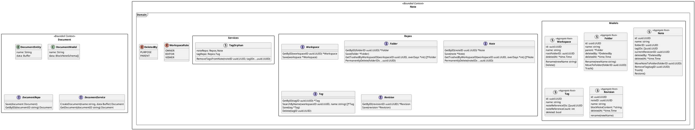

# Class Diagram

```plantuml
@startuml Notopia

skinparam classFontStyle bold
skinparam classAttributeIconSize 0
skinparam packageStyle rectangle
/' skinparam linetype ortho '/
/' skinparam linetype polyline '/

'Sytax of typescript'
package "Document" <<Bounded Context>> {
    entity "DocumentEntity" as Document.DocumentEntity {
        name: String
        data: Buffer
    }

    class "DocumentModel" as Document.DocumentModel {
        name: String
        data: BlockNoteSchema[]
    }

    interface "DocumentRepo" as Document.DocumentRepo {
        Save(document Document)
        GetByID(documentID string) Document
    }

    interface "DocumentService" as Document.DocumentService {
        CreateDocument(name string, data Buffer) Document
        GetDocument(documentID string) Document
    }
}

'Syntax of golang'
package "Note" <<Bounded Context>> {
    package "Domain" as Note.Domain <<Frame>> {
        enum "WorkspaceRole" as Note.Domain.WorkspaceRole {
            OWNER
            EDITOR
            VIEWER
        }

        enum "DeletedBy" as Note.Domain.DeletedBy {
            PURPOSE
            PARENT
        }

        package "Models" as Note.Domain.Models {
            struct "Workspace" as Note.Domain.Models.Workspace <<Aggregate Root>> {
                id: uuid.UUID
                name: string
                rootFolderID: uuid.UUID
                deletedAt: *time.Time

                Rename(newName string)
                Delete()
            }

            struct "Folder" as Note.Domain.Models.Folder <<Aggregate Root>> {
                id: uuid.UUID
                name: string
                parent: *Folder
                deletedBy: *DeletedBy
                deletedAt: *time.Time

                Rename(newName string)
                MoveToFolder(folderID uuid.UUID)
                Trash()
            }

            struct "Note" as Note.Domain.Models.Note <<Aggregate Root>> {
                id: uuid.UUID
                name: string
                folderID: uuid.UUID
                tagIDs: []uuid.UUID
                currentRevisionID: uuid.UUID
                deletedBy: *DeletedBy
                deletedAt: *time.Time

                MoveNoteToFolder(folderID uuid.UUID)
                RemoveTag(tagID uuid.UUID)
                Trash()
                Restore()
            }

            struct "Tag" as Note.Domain.Models.Tag <<Aggregate Root>> {
                id: uuid.UUID
                name: string
                noteReferenceIDs: []uuid.UUID
                noteReferenceCount: int
                deleted: bool
            }

            struct "Revision" as Note.Domain.Models.Revision <<Aggregate Root>> {
                id: uuid.UUID
                noteID: uuid.UUID
                name: string
                blockNoteContent: *string
                deletedAt: *time.Time

                rename(newName)
            }
        }

        package "Repos" as Note.Domain.Repos {
            interface "Workspace" as Note.Domain.Repos.Workspace {
                GetByID(workspaceID uuid.UUID) *Workspace
                Save(workspace *Workspace)
            }

            interface "Folder" as Note.Domain.Repos.Folder {
                GetByID(folderID uuid.UUID) *Folder
                Save(folder *Folder)
                GetTrashedByWorkspaceID(workspaceID uuid.UUID, overDays *int) []*Folder
                PermanentlyDelete(folderIDs ...uuid.UUID)
            }

            interface "Note" as Note.Domain.Repos.Note {
                GetByID(noteID uuid.UUID) *Note
                Save(note *Note)
                GetTrashedByWorkspaceID(workspaceID uuid.UUID, overDays *int) []*Note
                PermanentlyDelete(noteIDs ...uuid.UUID)
            }

            interface "Tag" as Note.Domain.Repos.Tag {
                GetByID(tagID uuid.UUID) *Tag
                SearchByName(workspaceID uuid.UUID, name string) []*Tag
                Save(tag *Tag)
                Delete(tagID uuid.UUID)
            }

            interface "Revision" as Note.Domain.Repos.Revision {
                GetByID(revisionID uuid.UUID) *Revision
                Save(revision *Revision)
            }
        }

        package "Services" as Note.Domain.Services {
            struct "TagOrphan" as Note.Domain.Services.TagOrphan {
                noteRepo: Repos.Note
                tagRepo: Repos.Tag

                RemoveTagsFromNote(noteID uuid.UUID, tagIDs ...uuid.UUID)
            }
        }
    }
}
@enduml
```

<!-- diagram id="class-diagram" -->

<!-- vim:set tabstop=4 shiftwidth=4: -->
