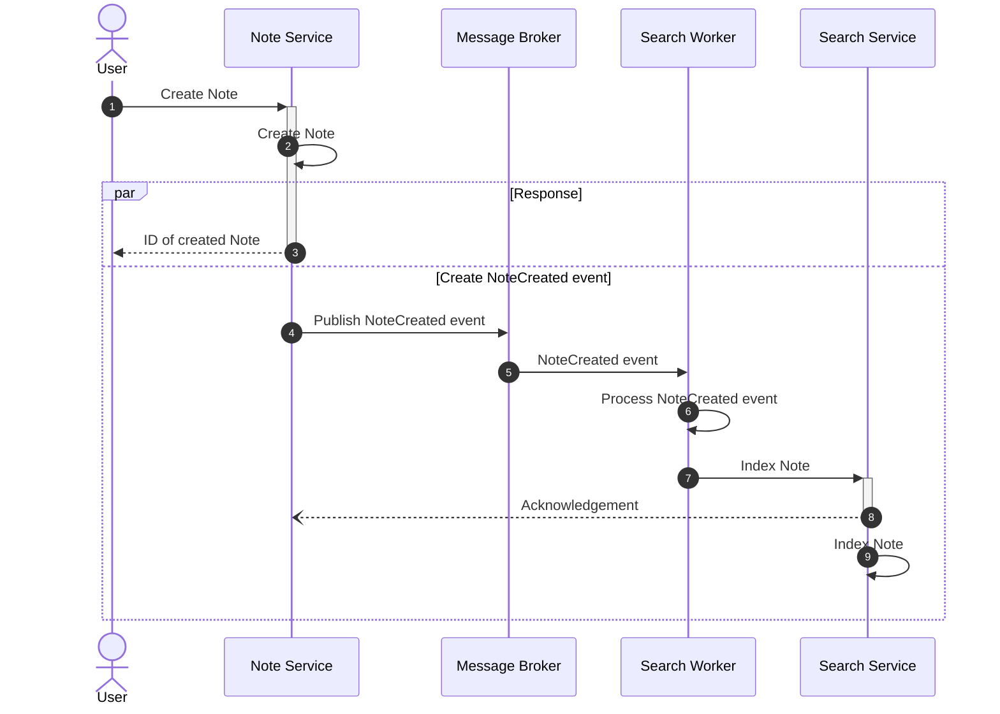
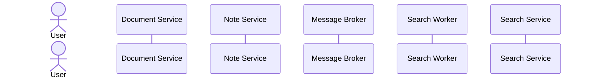
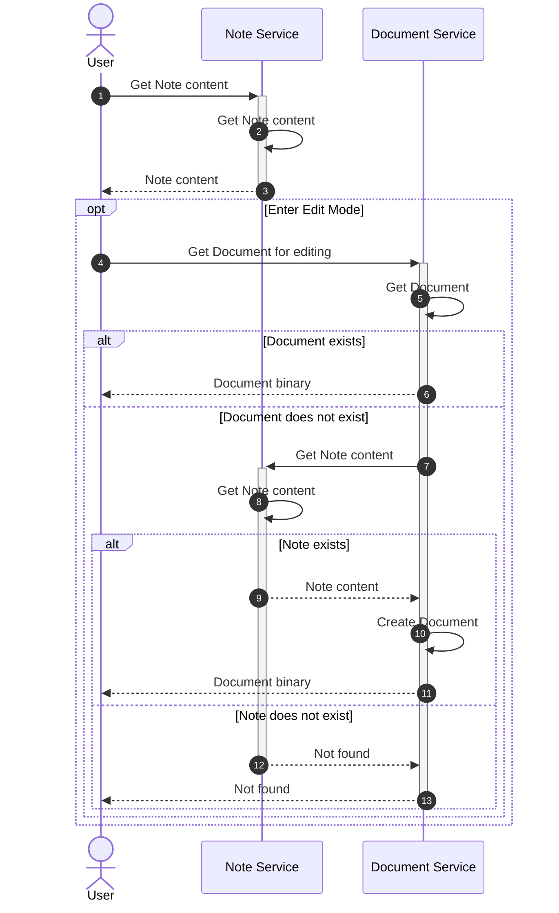
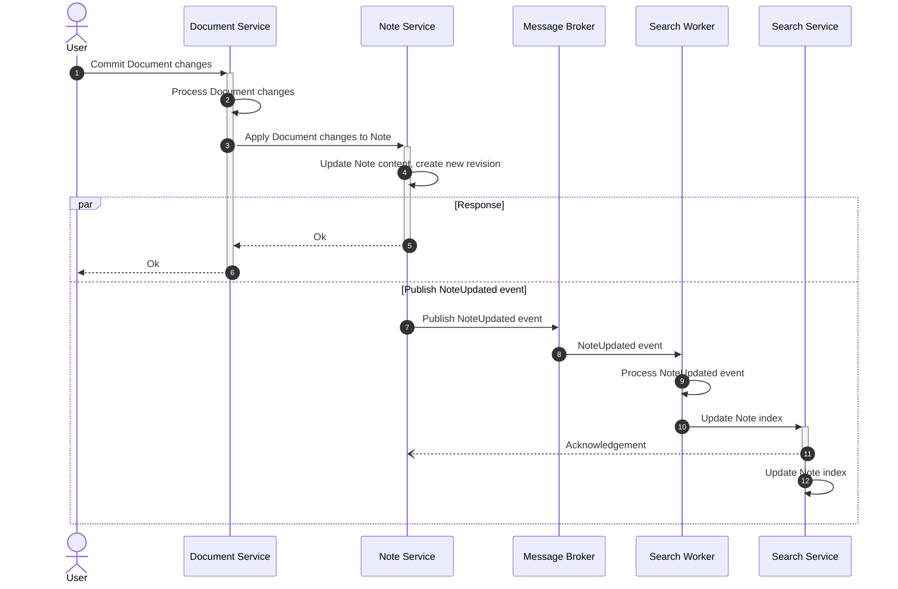
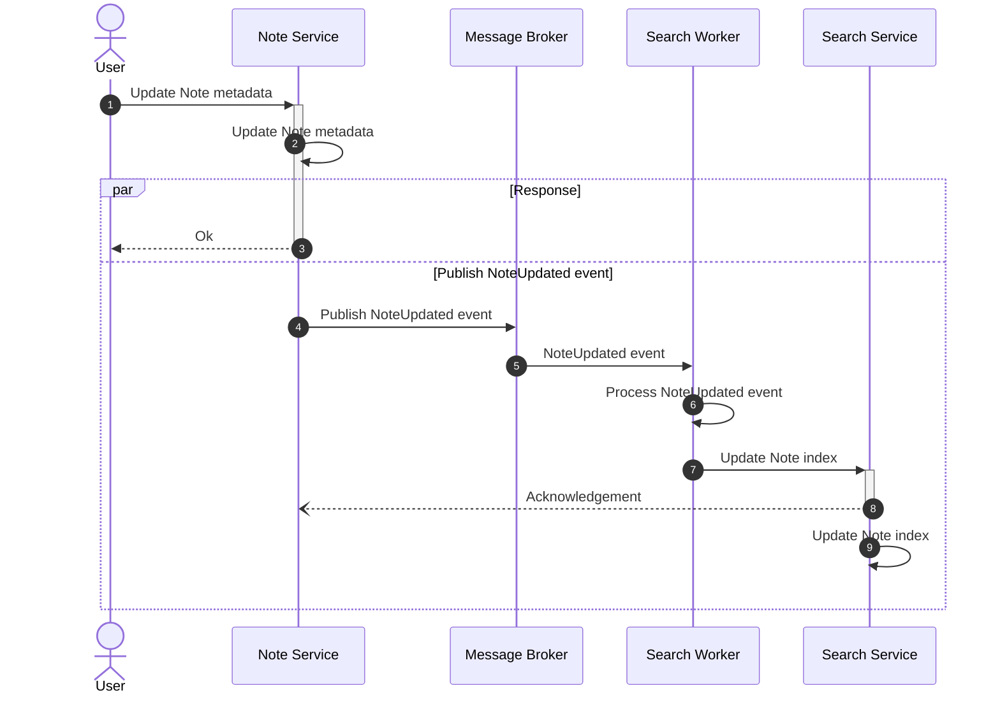
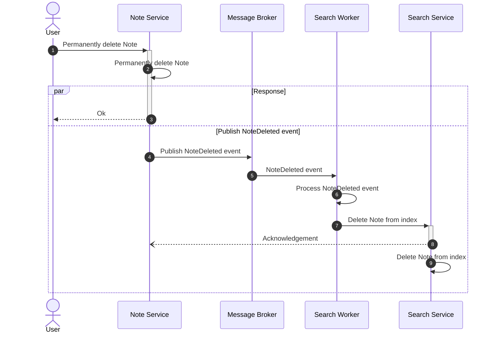

# Note

:::info

- `Note` includes the tree structure content _(BlockNoteJS model)_, which is used for feeding data into the editing action
- `Document` is the `Note` content in binary format for editing and collaboration

:::

## Create Note

## Import Document

## Get Note

## Commit Note

## Update Note

:::info

Update Note mean just update the Note metadata, like name, folderId (move), trashed, icon...

:::

## Permanently Delete Note

<!-- vim:set tabstop=4 shiftwidth=4: -->
