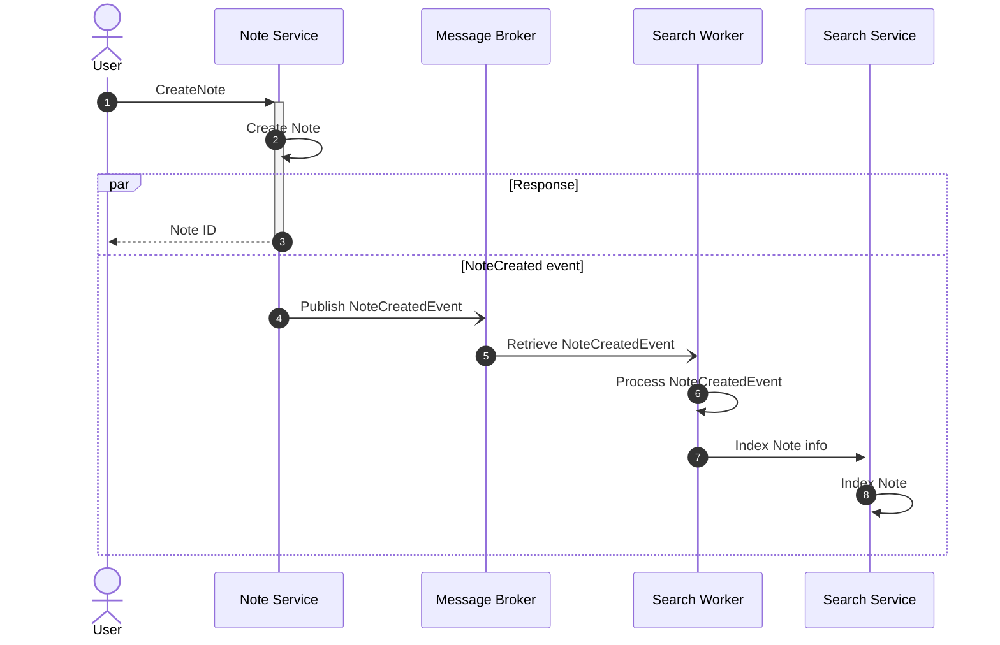
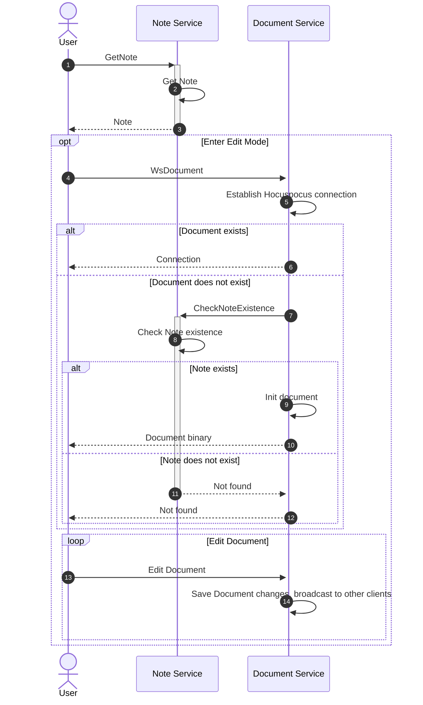
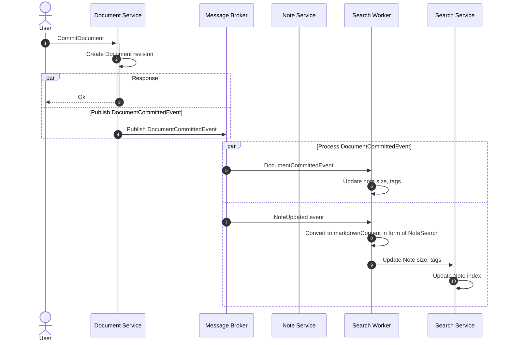
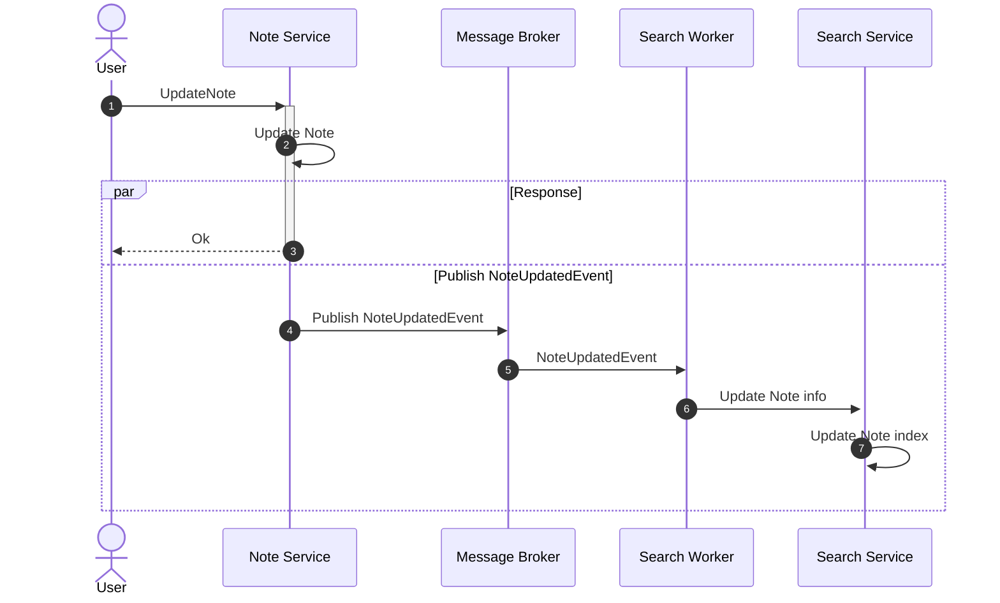
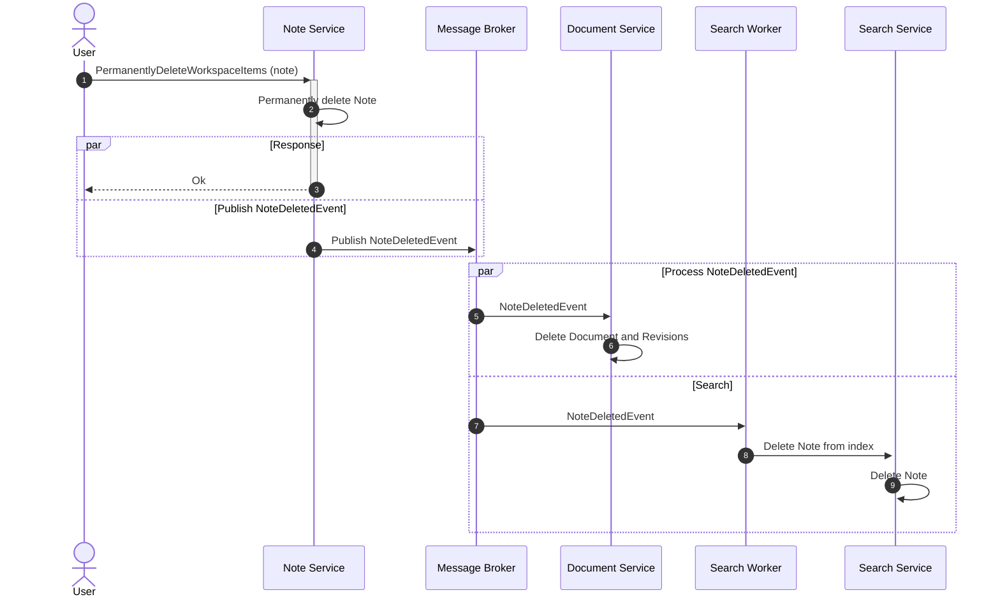

# Note

:::info

- `Note` only store the info
- `Document` is the `Note` content in binary format for editing and collaboration

:::

## Create Note

## Get Note

## Commit Note

## Update Note

:::info

- This also include the trash and restore note

:::

## Permanently Delete Note

<!-- vim:set tabstop=4 shiftwidth=4: -->
