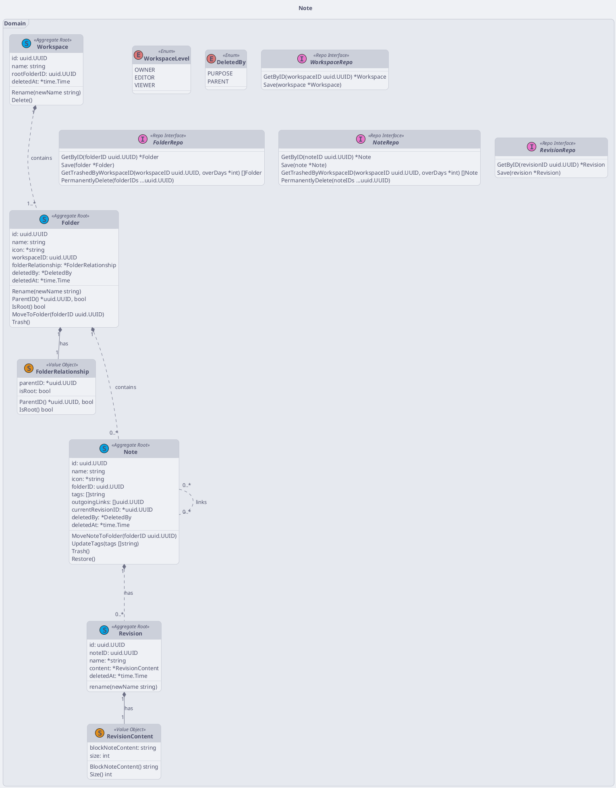
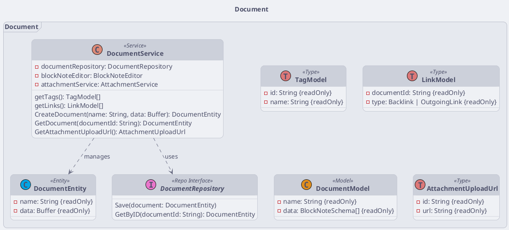

# Class Diagram

## Note

<!-- diagram id="class-diagram-note" -->

:::info

- Golang syntax
- Apply DDD, CQRS, repository pattern

:::

## Document

<!-- diagram id="class-diagram-document" -->

:::info

- Typescript syntax
- Apply layered architecture, repository pattern

:::

<!-- vim:set tabstop=4 shiftwidth=4: -->
