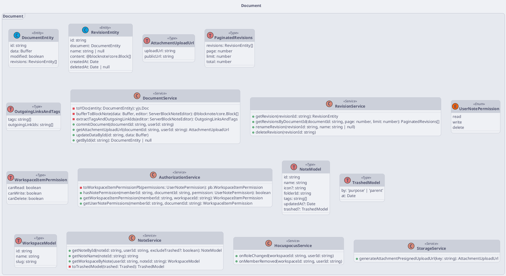

# Document Class Diagram

:::info

- Typescript syntax
- Apply layered architecture, use NestJS framework

:::

<!-- diagram id="class-diagram-document" -->

<!-- vim:set tabstop=4 softtabstop=4 shiftwidth=4: -->
