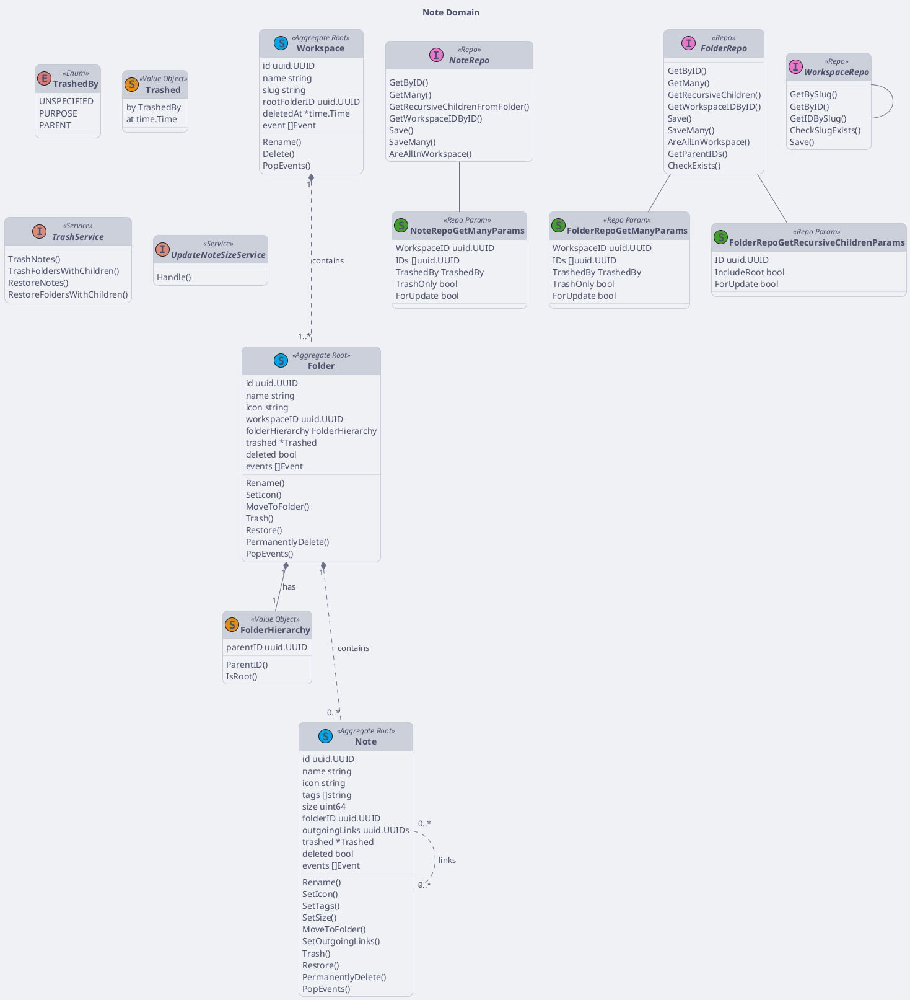

# Note Class Diagram

:::info

- Golang syntax
- Apply DDD, CQRS, repository pattern, clean architecture

:::

## Domain Layer

<!-- diagram id="class-diagram-note-domain" -->

## Application Layer

```plantuml
@startuml Note
title App Layer

!$rosewater = "#dc8a78"
!$flamingo  = "#dd7878"
!$pink      = "#ea76cb"
!$mauve     = "#8839ef"
!$red       = "#d20f39"
!$maroon    = "#e64553"
!$peach     = "#fe640b"
!$yellow    = "#df8e1d"
!$green     = "#40a02b"
!$teal      = "#179299"
!$sky       = "#04a5e5"
!$sapphire  = "#209fb5"
!$lavender  = "#7287fd"
!$blue      = "#1e66f5"
!$text      = "#4c4f69"
!$subtext1  = "#5c5f77"
!$subtext0  = "#6c6f85"
!$overlay2  = "#7c7f93"
!$overlay1  = "#8c8fa1"
!$overlay0  = "#9ca0b0"
!$surface2  = "#acb0be"
!$surface1  = "#bcc0cc"
!$surface0  = "#ccd0da"
!$base      = "#eff1f5"
!$mantle    = "#e6e9ef"
!$crust     = "#dce0e8"

skinparam backgroundColor $base
skinparam defaultFontColor $text
skinparam roundcorner 16
skinparam classFontStyle bold

skinparam ArrowColor $subtext0
skinparam packageStyle rectangle

skinparam package {
    BackgroundColor $mantle
    BorderColor $surface1
    FontColor $mauve
}

skinparam class {
    BackgroundColor $base
    BorderColor $surface1
    HeaderBackgroundColor $surface0
    AttributeFontColor $text
}

!define Model(name) class "name" as name <<(Q, $lavender) Model>>
!define ServiceInterface(name) interface "name" as name <<(I, $teal) Service>>

Model(Trashed) {
    TrashedBy TrashedBy
    TrashedAt time.Time
}

Model(Note) {
    ID uuid.UUID
    Name string
    Icon string
    Tags []string
    Size int32
    FolderID uuid.UUID
    BacklinksCount int
    OutgoingLinksCount int
    Trashed *Trashed
    UpdatedAt time.Time
}

Model(Folder) {
    ID uuid.UUID
    Name string
    Icon string
    ParentID uuid.UUID
    WorkspaceID uuid.UUID
    Trashed *Trashed
    UpdatedAt time.Time
}

Model(Workspace) {
    ID uuid.UUID
    Slug string
    Name string
}

Model(WorkspaceMember) {
    ID string
    Username string
    Role WorkspaceRole
}

Model(NoteLink) {
    ID uuid.UUID
    Name string
    Icon string
}

Model(NoteLinkResult) {
    OutgoingLinks []*NoteLink
    Backlinks []*NoteLink
}

Model(GraphNode) {
    ID string
    Name string
    Type GraphNodeType
    Weight float64
}

Model(GraphLink) {
    Source string
    Target string
}

Model(Graph) {
    Nodes []*GraphNode
    Links []*GraphLink
}

Model(WorkspaceTreeNote) {
    ID uuid.UUID
    Name string
    Icon string
    UpdatedAt time.Time
}

Model(WorkspaceTreeFolder) {
    ID uuid.UUID
    Name string
    Icon string
    Notes []*WorkspaceTreeNote
    Children []*WorkspaceTreeFolder
    UpdatedAt time.Time
}

Model(TrashedNote) {
    ID uuid.UUID
    Name string
    Icon string
    Trashed Trashed
}

Model(TrashedFolder) {
    ID uuid.UUID
    Name string
    Icon string
    Trashed Trashed
}

Model(Trash) {
    Notes []*TrashedNote
    Folders []*TrashedFolder
}

Model(Pagination) {
    Page int
    Limit int
    Total int
    TotalPages int
    hasNext bool
    hasPrev bool
}

Model(PaginationParams) {
    Page int
    Limit int
}

enum "GraphNodeType" as GraphNodeType {
    NOTE
    TAG
}

enum "TrashedBy" as TrashedBy {
    PURPOSE
    PARENT
}

enum "WorkspaceRole" as WorkspaceRole {
    OWNER
    EDITOR
    VIEWER
}

ServiceInterface(AuthorizationService) {
    HasWorkspacePermission()
    HasWorkspaceItemPermission()
    HasWorkspaceNotePermission()
    HasWorkspaceFolderPermission()
    CreateWorkspaceWithOwner()
    UpdateWorkspaceMembers()
    GetWorkspaceMembers()
}

ServiceInterface(IntegrationPublisher) {
    Publish()
}

interface "IntegrationEvent" as IntegrationEvent {
    isIntegrationEvent()
}

class "IntegrationEventNoteCreated" as IntegrationEventNoteCreated {
    ID uuid.UUID
    Name string
    Icon string
}

class "IntegrationEventNoteDeleted" as IntegrationEventNoteDeleted {
    ID uuid.UUID
}

class "IntegrationEventNoteUpdated" as IntegrationEventNoteUpdated {
    ID uuid.UUID
    Name string
    Icon string
    Tags []string
    Size uint64
    FolderID uuid.UUID
    OutgoingLinks uuid.UUIDs
    UpdatedAt time.Time
}

ServiceInterface(WorkspaceEventPublisher) {
    Publish()
}

ServiceInterface(WorkspaceEventSubscriber) {
    Subscribe()
}

ServiceInterface(WorkspaceEventHub) {
}

interface "WorkspaceEvent" as WorkspaceEvent {
    isWorkspaceEvent()
    GetID()
    GetEvent()
}

class "WorkspaceEventWorkspaceItemsUpdated" as WorkspaceEventWorkspaceItemsUpdated {
    Id uuid.UUID
    Event note.WorkspaceItemsUpdatedEventEvent
    Data any
}

class "WorkspaceEventMembersUpdated" as WorkspaceEventMembersUpdated {
    Id uuid.UUID
    Event note.WorkspaceMembersUpdatedEventEvent
    Data any
}

class "WorkspaceEventWorkspaceUpdated" as WorkspaceEventWorkspaceUpdated {
    Id uuid.UUID
    Event note.WorkspaceUpdatedEventEvent
    Data any
}

class "WorkspaceEventWorkspaceDeleted" as WorkspaceEventWorkspaceDeleted {
    Id uuid.UUID
    Event note.WorkspaceDeletedEventEvent
    Data any
}

Note -- Trashed
Folder -- Trashed
NoteLinkResult -- NoteLink
Graph -- GraphNode
Graph -- GraphLink
WorkspaceTreeFolder -- WorkspaceTreeNote
WorkspaceTreeFolder -- WorkspaceTreeFolder
Trash -- TrashedNote
Trash -- TrashedFolder
IntegrationEventNoteCreated ..|> IntegrationEvent
IntegrationEventNoteDeleted ..|> IntegrationEvent
IntegrationEventNoteUpdated ..|> IntegrationEvent
WorkspaceEventWorkspaceItemsUpdated ..|> WorkspaceEvent
WorkspaceEventMembersUpdated ..|> WorkspaceEvent
WorkspaceEventWorkspaceUpdated ..|> WorkspaceEvent
WorkspaceEventWorkspaceDeleted ..|> WorkspaceEvent
WorkspaceEventHub ..|> WorkspaceEventPublisher
WorkspaceEventHub ..|> WorkspaceEventSubscriber
@enduml
```

<!-- diagram id="class-diagram-note-application" -->
